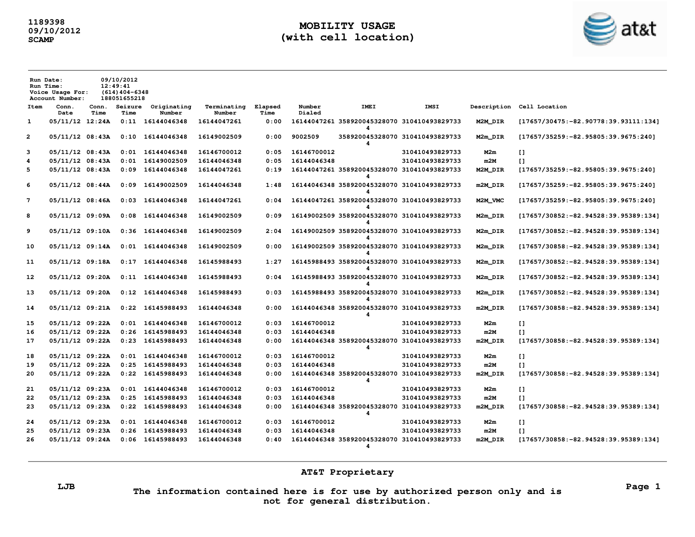
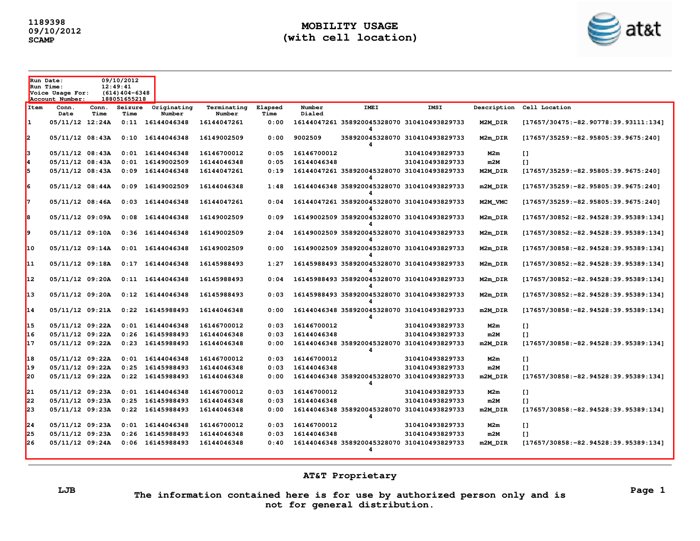

# python-att-mobility-pdf-extractor

Extract voice, data, and SMS records from AT&T Mobility Usage PDF reports into structured CSV files — automatically, page by page, with no manual copying.

*Status: April 2026*

---

#### ⚡ Quick Navigation: [The Problem](#the-problem) | [How it Works](#how-it-works) | [The Debug Step](#the-debug-step) | [Output](#output) | [Quick Start](#quick-start) | [📩 Get in Touch](#need-this-for-your-organisation)

---

## The problem

A PDF lands on your desk. Fifty-one pages. Hundreds of rows. Three types of records — voice calls, data sessions, SMS messages — mixed across the pages, each with its own set of columns.

Someone needs that data in a spreadsheet. Or a database. Or a case management system.

The obvious move is to open the PDF, select the table, and paste it somewhere. Except it does not paste cleanly. The columns bleed into each other. The multi-line rows collapse. The cell location coordinates — `[17657/30852:-82.94528:39.95389:134]` — end up split across three cells.

So someone copies it row by row. Or writes a fragile script that breaks the moment the layout shifts by a few pixels.

This project solves that problem properly.



---

## Context

AT&T Mobility Usage reports are lawful intercept documents — PDFs generated by AT&T's SCAMP system in response to court orders or law enforcement requests. They contain the full call detail records (CDRs) for a given number over a given period: every call made and received, every data session opened, every SMS sent or received — with timestamps, durations, IMEI, IMSI, and cell tower location.

These documents are used in criminal investigations, civil litigation, and compliance workflows. The data inside them needs to be ingested into analysis tools, mapped against timelines, or cross-referenced with other records.

Doing that manually, page by page, is not a workflow. It is a bottleneck.

---

## How it works

The PDF contains real text — not a scanned image — laid out as a fixed-width table across landscape pages. `pdfplumber` is used to extract the data spatially, using the position of known anchor words to locate the header block and table area on each page.

```
program.py
    │
    ├── INSPECTION
    │     ├── pdfplumber_to_fitz()   — convert coordinates between pdfplumber and PyMuPDF
    │     └── draw_section_areas()   — render coloured boxes onto a debug PDF
    │
    └── EXTRACTION
          ├── normalize_table()      — merge split rows into single clean rows
          ├── extract_data()         — iterate all pages, detect section type, accumulate records
          └── write_csv()            — write voice / data / SMS records to separate CSV files
```

### Detecting the section type

Each page belongs to one of three sections — Voice, Data, or SMS. The section type is identified from the page header, which contains a line like `Voice Usage For: (614)404-6348`. The header area is cropped spatially using the position of the word `Run` as the top anchor and `Number:` as the bottom anchor.

```python
if 'Voice Usage For:' in header_text:
    section_type = 'voice'
elif 'Data Usage For:' in header_text:
    section_type = 'data'
elif 'SMS Usage For:' in header_text:
    section_type = 'sms'
```

### Extracting the table

The table area is cropped from `Item` (the first column header) down to just above the `AT&T Proprietary` footer. Within that crop, `pdfplumber` extracts the table using a text-based strategy — no borders required.

```python
table = table_crop.extract_table({
    "vertical_strategy": "text",
    "horizontal_strategy": "text",
})
```

### Normalising split rows

Some records span two visual lines in the PDF — the IMEI appears on a second line below the main row, for example. The raw table reflects this as separate rows where the first cell is empty. `normalize_table()` detects these and merges them column by column into a single clean row.

---

## The debug step

Running `extract_data()` with `inspect=True` produces a debug PDF (`sections_inspection.pdf`) showing exactly which areas are being used for the header and table extraction on the first page. Adjust the anchor logic until the boxes sit correctly, then run the full extraction.



---

## Output

Three CSV files, one per section:

```
output/
├── voice_usage.csv
├── data_usage.csv
└── sms_usage.csv
```

See full CSV outputs in the `output/` folder.

### Voice records

| Item | Conn. Date | Conn. Time | Seizure Time | Originating Number | Terminating Number | Elapsed Time | Number Dialed | IMEI | IMSI | Description | Cell Location |
|---|---|---|---|---|---|---|---|---|---|---|---|
| 1 | 05/11/12 | 12:24A | 0:11 | 16144046348 | 16144047261 | 0:00 | 16144047261 | 358920045328070 | 310410493829733 | M2M_DIR | [17657/30475:-82.90778:39.93111:134] |

### Data records

| Item | Conn. Date | Conn. Time | Originating Number | Elapsed Time | Bytes Up | Bytes Down | IMEI | IMSI | Access Pt | Description | Cell Location |
|---|---|---|---|---|---|---|---|---|---|---|---|
| 1 | 05/11/12 | 12:20A | 16144046348 | 14:54 | 242280 | 487774 9 | 3589200453280704 | 310410493829733 | phone | _MOBILE_DATA_ | [17657/30851:-82.94528:39.95389:19] |
### SMS records

| Item | Conn. Date | Conn. Time | Originating Number | Terminating Number | IMEI | IMSI | Description | Cell Location |
|---|---|---|---|---|---|---|---|---|
| 1 | 05/11/12 | 09:51A | 1852894 | 16144046348 | 3589200453280704 | 310410493829733 | IN | [17657/30452:-82.82917:39.95417:134] |

---

## Quick Start

```bash
git clone https://github.com/hasff/python-att-mobility-pdf-extractor.git
cd python-att-mobility-pdf-extractor
python -m venv venv
source venv/bin/activate   # Windows: venv\Scripts\activate
pip install -r requirements.txt
```

Place your AT&T Mobility Usage PDF in the `input/` folder, rename it to `att_original.pdf`, and run:

```bash
python program.py
```

The extracted records will be saved to the `output/` folder as three CSV files.

To run in inspection mode and verify the detected areas visually:

```python
# in program.py __main__ block
data = extract_data(FILE, inspect=True)
```

This saves a `sections_inspection.pdf` to `output/` with the header and table areas highlighted.

---

## Need this for your organisation?

CDR analysis is a common bottleneck in investigations and compliance workflows. The records are all there — timestamps, cell towers, device identifiers — but locked in a format that does not connect to anything.

I build PDF data extraction pipelines for:

- legal teams and investigators processing carrier records for litigation or case analysis
- compliance and audit functions handling telecommunications data
- anyone who currently copies CDR data out of PDFs by hand

📩 Contact: hugoferro.business(at)gmail.com

🌐 Courses and professional tools: https://hasff.github.io/site/

---

## Further Learning

The `pdfplumber` techniques used in this project — coordinate-based spatial cropping, text strategy table extraction, rotation handling, and the relationship between `pdfplumber` and `PyMuPDF` coordinate spaces — are covered in depth in my course:

[**Python PDF Manipulation: From Beginner to Winner (PyMuPDF)**](https://www.udemy.com/course/python-pdf-handling-from-beginner-to-winner/?referralCode=E7B71DCA8314B0BAC4BD)

The repository is fully usable on its own. The course provides the deeper understanding behind the decisions made here.
